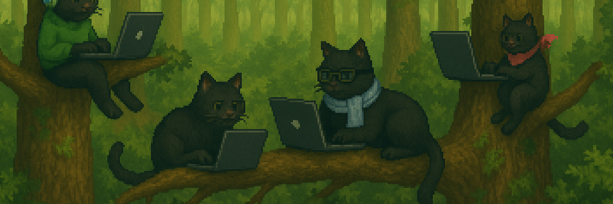

# simsOS — Web-based Desktop Environment

A modern web-based desktop environment inspired by classic macOS, built with React and modern web technologies. Features multiple built-in applications and a familiar desktop interface. Works on all devices—including mobile, tablet, and desktop.

## Tech Stack

- React 18.3 with TypeScript
- Vite 6.0 for blazing fast development
- TailwindCSS 4.0 for styling
- shadcn/ui components
- Framer Motion for animations
- Bun as package manager
- WaveSurfer.js for audio visualization
- Tone.js for audio synthesis

## Getting Started

```bash
# Install dependencies
bun install

# Start development server
bun dev

# Build for production
bun run build
```

## Features

### Desktop Environment

- Authentic macOS-style window management
- Multiple resizable and draggable windows
- Desktop icons and dock
- Window minimize/maximize controls
- Menu bar with application-specific menus
- Customizable wallpapers (photos, patterns, or videos)
- System-wide sound effects
- Local storage persistence
- Optional CRT, Galaxy & Aurora shader effects
- System-wide UI, Chats, and Terminal sounds
- Local storage persistence with one-click Backup / Restore

### Built-in Applications

- **Finder**: File manager with Quick Access & Storage Info
- **TextEdit**: Rich text editing with markdown support and task lists
- **MacPaint**: Classic bitmap graphics editor
  - Drawing tools (pencil, brush, eraser)
  - Shape tools (rectangle, oval, line)
  - Fill patterns and colors
  - Selection and move tools
  - Undo/redo support
  - Image file import/export support
- **Videos**: Retro-style YouTube playlist player
  - VCR-style interface with LCD display
  - Add and manage YouTube videos
  - Playlist management with shuffle and repeat modes
  - Scrolling titles and classic CD player controls
  - Local storage persistence
- **Soundboard**: Create and manage custom soundboards
  - Record sounds directly from microphone
  - Multiple soundboards support
  - Waveform visualization
  - Keyboard shortcuts (1-9)
  - Import/export functionality
  - Emoji and title customization
  - Enhanced synth effects
- **Synth**: Virtual synthesizer with retro aesthetics
  - Virtual keyboard with computer key support
  - Multiple oscillator waveforms (sine, square, sawtooth, triangle)
  - Effects including reverb, delay, and distortion
  - Customizable synth parameters
  - MIDI input support
  - Preset saving and loading
  - Classic synthesizer UI design
- **Photo Booth**: Camera app with effects
  - Take photos with your webcam
  - Multiple photo effects and filters
  - Brightness and contrast adjustments
  - Photo gallery with thumbnails
  - Multi-photo sequence mode
  - Export photos to Files
  - Real-time filter preview
- **Internet Explorer**: Classic web browser experience
  - Wayback Machine integration for time travel
  - Classic UI with modern browsing capabilities
  - Historical web content viewing
- **Chats**: AI-powered chat & rooms
  - Natural conversation with Ryo AI
  - Join public chat rooms
  - Push-to-talk voice messages
  - Control apps or edit documents via chat commands
  - Save transcript to Markdown
- **Control Panels**: System preferences & power tools
  - Appearance & shader selection (CRT, Galaxy, Aurora)
  - UI / typing / Terminal sound toggles
  - One-click full Backup / Restore
  - Format or reset the virtual file system
- **Minesweeper**: Classic game implementation
- **Virtual PC**: DOS game emulator
  - Play classic games like Doom and SimCity
  - DOS environment emulation
  - Game save states
- **Terminal**: Unix-like CLI with built-in AI
  - Familiar commands (ls, cd, cat, touch, vim, edit, …)
  - ↑ / ↓ history & auto-completion
  - "ryo <prompt>" to chat with AI assistant
  - Open documents in TextEdit or Vim straight from prompt
  - Toggle distinctive Terminal sounds in View ▸ Sounds
- **iPod**: 1st-generation iPod-style music player
  - Import any YouTube URL to build your music library
  - Classic click-wheel navigation and back-light toggle
  - Shuffle and loop playback modes
  - Create playlists and organize tracks
  - Library persisted locally for offline playback

### Core Features

- Window management with draggable, resizable windows & z-index
- Shader-powered backgrounds (CRT scanlines, Galaxy, Aurora)
- System context Ryo AI across Terminal & Chats
- One-click Backup / Restore (localStorage & IndexedDB)
- Local persistence for every app (videos, music, docs…)
- Keyboard shortcuts & mobile-friendly gestures
- Responsive design for mobile and tablet
- Full virtual file system shared by Finder, Terminal, TextEdit & others
- System-wide audio with per-app toggles
- Import / Export for documents, sounds & wallpapers

## Project Structure

```
project/
├── src/
│   ├── apps/           # Individual applications
│   │   ├── base/       # Base app functionality
│   │   ├── finder/     # File system app
│   │   ├── textedit/   # Text editor app
│   │   ├── videos/     # YouTube playlist app
│   │   ├── soundboard/ # Audio recording app
│   │   ├── chats/      # Chat application
│   │   └── minesweeper/# Game implementation
│   ├── components/     # Shared React components
│   │   ├── layout/     # Core layout components
│   │   ├── ui/         # shadcn/ui components
│   │   └── dialogs/    # System dialogs
│   ├── hooks/         # Custom React hooks
│   └── utils/         # Shared utilities
├── api/               # Backend API endpoints
├── public/           # Static assets
└── ...config files
```

## Development

The project uses:

- TypeScript for type safety
- ESLint for code quality
- Tailwind for utility-first CSS
- shadcn/ui components built on Radix UI primitives
- Lucide icons
- Vercel for deployment

## Scripts

- `bun dev` - Start development server
- `bun run build` - Build for production
- `bun run lint` - Run ESLint
- `bun run preview` - Preview production build

## Contributing

Contributions are welcome! Please feel free to submit a Pull Request.
